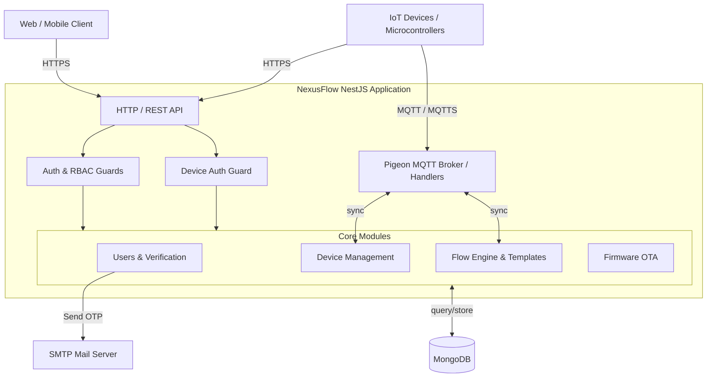
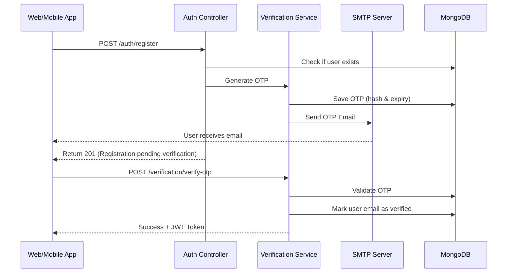
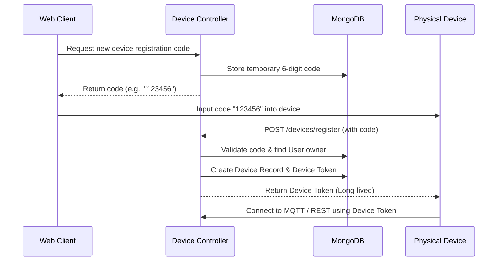
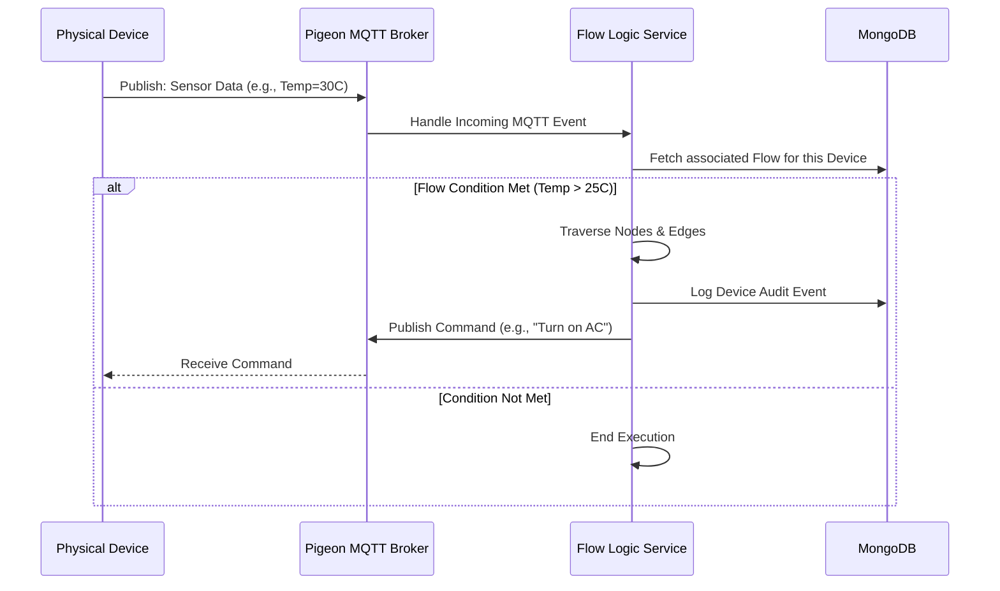

# NexusFlow Backend — System Architecture

```mermaid
graph TD
    Web[Web / Mobile Client]
    IoT[IoT Devices / Microcontrollers]
    SMTP[SMTP Mail Server]

    subgraph NexusFlowBackend ["NexusFlow NestJS Application"]
        direction TB
        
        REST[HTTP / REST API]
        MQTT_B[Pigeon MQTT Broker / Handlers]
        AuthGuard[Auth & RBAC Guards]
        DeviceGuard[Device Auth Guard]

        subgraph CoreModules ["Core Modules"]
            UsersMod[Users & Verification]
            DeviceMod[Device Management]
            FlowMod[Flow Engine & Templates]
            FirmwareMod[Firmware OTA]
        end
    end

    DB[(MongoDB)]

    Web -->|HTTPS| REST
    IoT -->|MQTT / MQTTS| MQTT_B
    IoT -->|HTTPS| REST

    REST --> AuthGuard
    REST --> DeviceGuard
    
    AuthGuard --> CoreModules
    DeviceGuard --> CoreModules
    
    MQTT_B <-->|sync| FlowMod
    MQTT_B <-->|sync| DeviceMod
    
    UsersMod -->|Send OTP| SMTP
    
    CoreModules <-->|query/store| DB
```
# User Registration & Email Verification

```mermaid
sequenceDiagram
    participant Client as Web/Mobile App
    participant Auth as Auth Controller
    participant Verify as Verification Service
    participant SMTP as SMTP Server
    participant DB as MongoDB

    Client->>Auth: POST /auth/register
    Auth->>DB: Check if user exists
    Auth->>Verify: Generate OTP
    Verify->>DB: Save OTP (hash & expiry)
    Verify->>SMTP: Send OTP Email
    SMTP-->>Client: User receives email
    Auth-->>Client: Return 201 (Registration pending verification)
    Client->>Verify: POST /verification/verify-otp
    Verify->>DB: Validate OTP
    Verify->>DB: Mark user email as verified
    Verify-->>Client: Success + JWT Token
```
# Device Provisioning & Registration

```mermaid
sequenceDiagram
    participant User as Web Client
    participant API as Device Controller
    participant DB as MongoDB
    participant IoT as Physical Device

    %% Step 1: User generates a code
    User->>API: Request new device registration code
    API->>DB: Store temporary 6-digit code
    API-->>User: Return code (e.g., "123456")

    %% Step 2: User inputs code to the physical device (via BLE/WiFi AP)
    User->>IoT: Input code "123456" into device

    %% Step 3: Device claims itself
    IoT->>API: POST /devices/register (with code)
    API->>DB: Validate code & find User owner
    API->>DB: Create Device Record & Device Token
    API-->>IoT: Return Device Token (Long-lived)

    %% Step 4: Normal operations
    IoT->>API: Connect to MQTT / REST using Device Token
```
# Flow Execution (Node/Edge Logic via MQTT)

```mermaid
sequenceDiagram
    participant IoT as Physical Device
    participant MQTT as Pigeon MQTT Broker
    participant FlowLogic as Flow Logic Service
    participant DB as MongoDB

    IoT->>MQTT: Publish: Sensor Data (e.g., Temp=30C)
    MQTT->>FlowLogic: Handle Incoming MQTT Event
    FlowLogic->>DB: Fetch associated Flow for this Device
    
    alt Flow Condition Met (Temp > 25C)
        FlowLogic->>FlowLogic: Traverse Nodes & Edges
        FlowLogic->>DB: Log Device Audit Event
        FlowLogic->>MQTT: Publish Command (e.g., "Turn on AC")
        MQTT-->>IoT: Receive Command
    else Condition Not Met
        FlowLogic->>FlowLogic: End Execution
    end
```