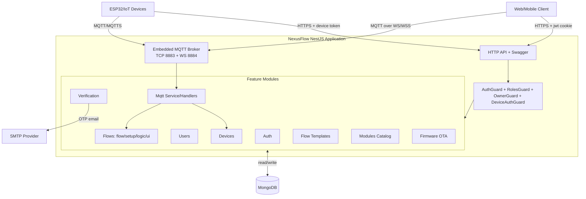
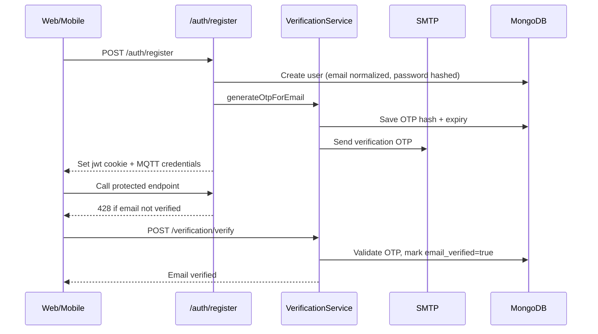
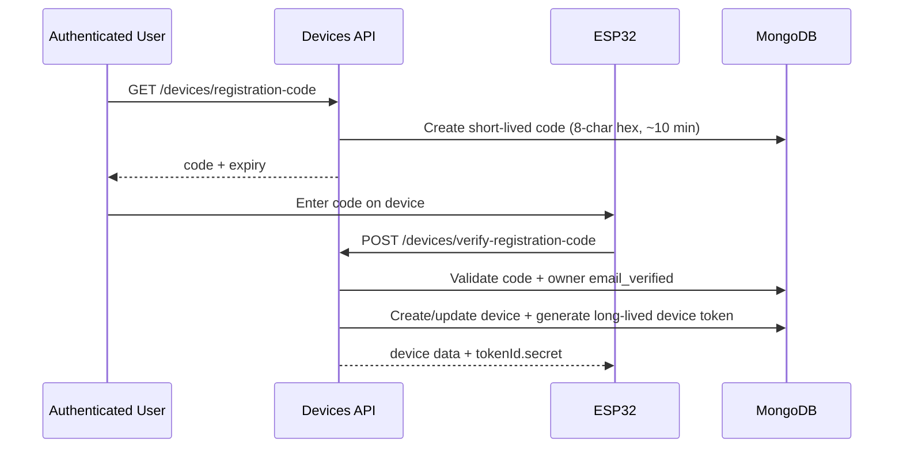
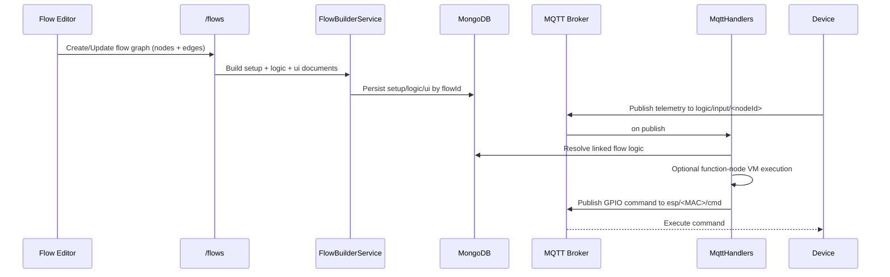

# NexusFlow Backend - System Architecture

## High-Level Architecture

## Runtime Composition

- Bootstrap: `src/main.ts`
- Root module wiring: `src/app.module.ts`
- Global config: `ConfigModule.forRoot({ isGlobal: true })`
- Persistence: `MongooseModule.forRootAsync(...)` with `MONGO_URI`
- HTTP concerns:
  - CORS is required and validated from `CORS_ORIGINS`
  - global `ValidationPipe`
  - cookie parser
  - Swagger at `/api`
- Embedded MQTT broker:
  - configured in `src/mqtt/mqtt.module.ts`
  - TCP on `8883`
  - WS on `MQTT_WS_PORT` (default `8884`) and `MQTT_WS_PATH` (default `/mqtt-ws`)
  - optional TLS/WSS cert material from env

## Security Model

- User auth: HttpOnly cookie `jwt` (`src/gaurds/auth/auth.guard.ts`)
- Device auth: Bearer token `tokenId.secret` (`src/gaurds/device-auth.guard.ts`)
- Role checks: `RolesGuard` with owner as super-role
- Ownership checks: `OwnerGuard` for flow/device/deviceToken resources
- Important behavior:
  - `POST /auth/register` logs user in immediately (sets cookie + returns MQTT creds)
  - unverified users are blocked from most endpoints by `AuthGuard` with HTTP `428`
  - allowed while unverified: `/auth/*`, `/verification/*`, `/users/profile`

## Main Domain Flows

### 1) Registration + Email Verification

### 2) Device Provisioning

### 3) Flow Build and Runtime Execution

## Feature Modules (Current)

- `auth`: register/login/logout, forgot/reset password, JWT issuing
- `users`: profile, MQTT OTP, admin user management, default owner seed
- `verification`: OTP generation/verification + password reset OTP via SMTP
- `devices`: registration code flow, device CRUD, token lifecycle, flow linking, status
- `flows`: flow CRUD + derived setup/logic/ui generation
- `flow-templates`: admin template management + user forking
- `modules`: admin catalog for hardware/module metadata
- `firmware`: admin upload/delete, device update check, device binary download (rate-limited)
- `mqtt`: broker integration, authz/authn hooks, active-client visibility, runtime flow execution

## Data Stores (MongoDB)

Main collections represented by Mongoose schemas:

- users, email verification OTPs
- devices, device tokens, device audits, registration codes
- flows, setups, logics, UIs
- flow templates
- module catalog
- firmware metadata

## Notes

- MQTT is part of this backend deployment (not an external broker in this repo).
- MQTT auth supports both user clients and ESP clients with different auth paths.
- Function nodes are statically validated and executed in a restricted VM context.
