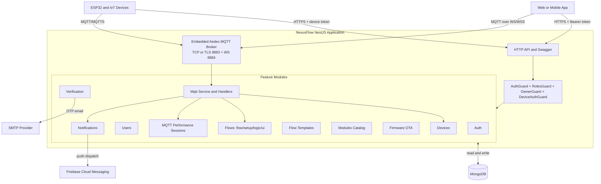
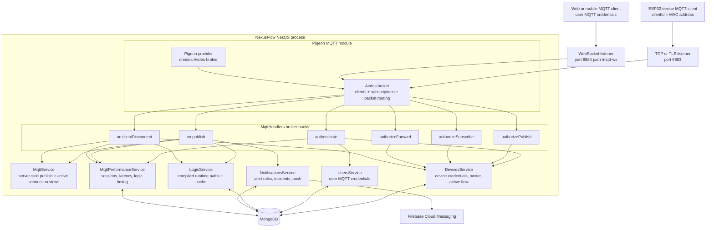
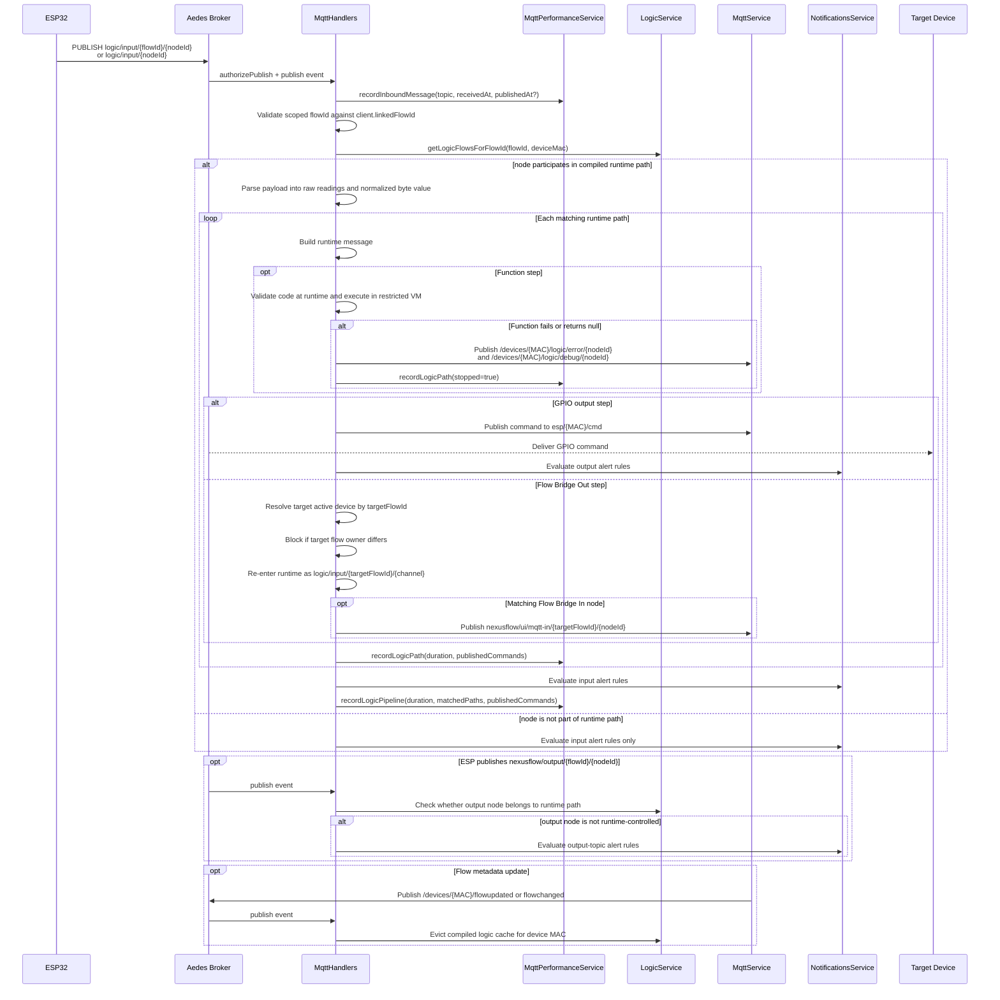
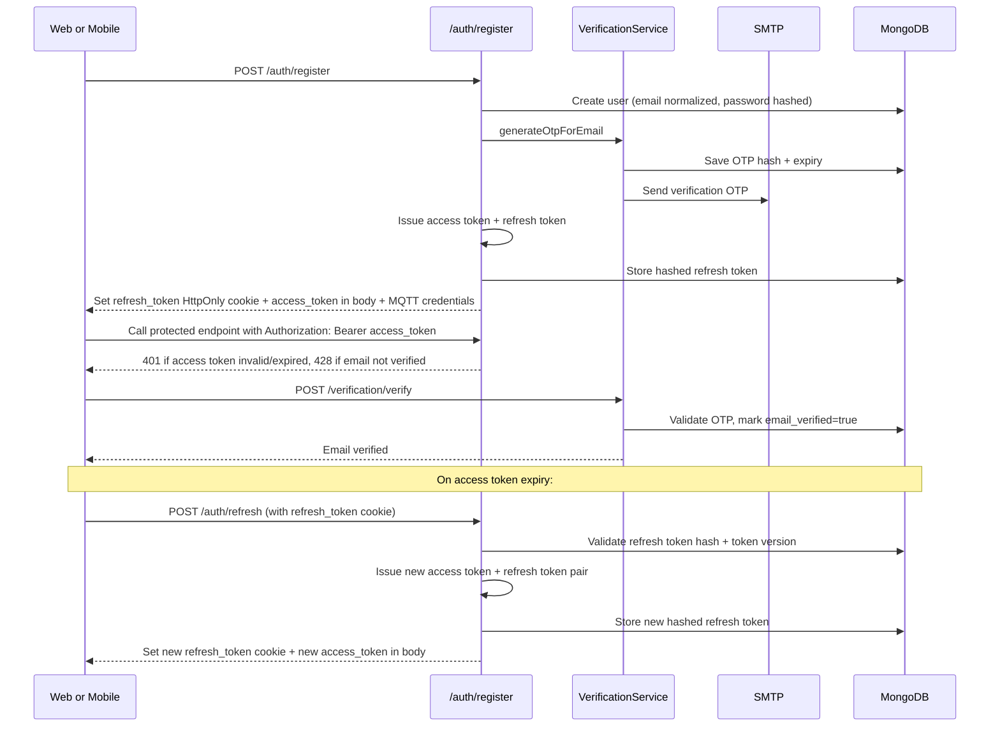
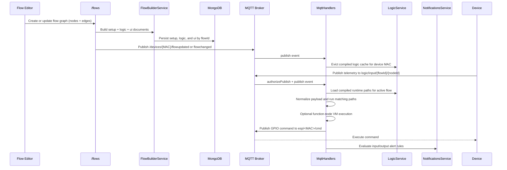
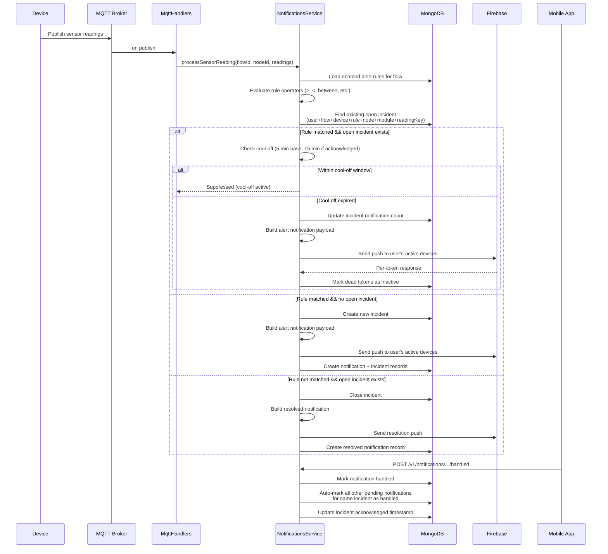
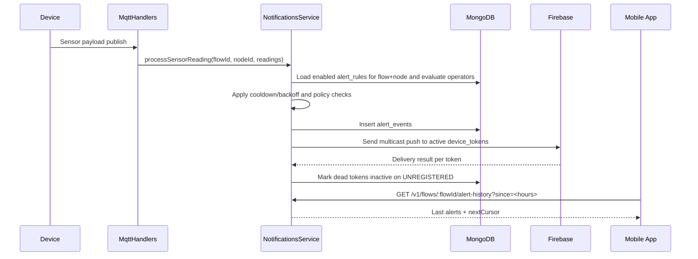

# NexusFlow Backend - System Architecture

## High-Level Architecture

## Runtime Composition

- Bootstrap: `src/main.ts`
- Root module wiring: `src/app.module.ts`
- Global config: `ConfigModule.forRoot({ isGlobal: true })`
- Persistence: `MongooseModule.forRootAsync(...)` with `MONGO_URI`
- HTTP concerns:
  - CORS required and validated from `CORS_ORIGINS`
  - global `ValidationPipe`
  - cookie parser
  - Swagger at `/api`
- Embedded MQTT broker:
  - configured in `src/mqtt/mqtt.module.ts`
  - TCP on `8883`; switches to TLS on the same port when valid TLS key/cert material is configured
  - WS on `MQTT_WS_PORT` (default `8884`) and `MQTT_WS_PATH` (default `/mqtt-ws`)
  - optional TLS/WSS cert material from env
  - Aedes broker is created by `src/pigeon-mqtt/pigeon.provider.ts`
  - broker auth, topic authorization, publish handling, disconnect handling, and performance hooks are installed by `src/mqtt/mqtt.handlers.ts`
- Notifications runtime:
  - configured in `src/notifications/notifications.module.ts`
  - Firebase Admin credentials via:
    - `FIREBASE_PROJECT_ID`
    - `FIREBASE_CLIENT_EMAIL`
    - `FIREBASE_PRIVATE_KEY`
  - optional internal trigger key: `INTERNAL_ALERTS_API_KEY`
  - rule cooldown tuning: `ALERT_RULE_COOLDOWN_MS`
  - gas alert max backoff tuning: `ALERT_RULE_MAX_BACKOFF_MS`

## MQTT Server Internals

### MQTT Connection and Authorization

- **ESP clients** identify themselves with a MAC-address `clientId`.
  - Optional MQTT username must match the MAC address.
  - Password is checked by `DevicesService.authenticateByMacAndPassword`.
  - Revoked devices are rejected.
  - Only one live MQTT session is reserved per device MAC.
  - The broker client object is enriched with `deviceMac`, `deviceId`, `ownerId`, `ownerUsername`, `linkedFlowId`, and `connectedAt`.
  - A performance session starts when authentication succeeds.

- **User clients** authenticate with user MQTT username/password.
  - User account must be active.
  - A user can have at most 5 active MQTT sessions.
  - The broker client object is enriched with `userId`, `mqttUsername`, `authorizedDeviceMacs`, and `connectedAt`.

- **Protected topic authorization**:
  - `/devices/{mac}/...` and `devices/{mac}/...` are scoped to the matching ESP device or to a user who owns that device.
  - `esp/{mac}/...` is scoped to the matching ESP device or to a user who owns that device.
  - Wildcard subscriptions on protected topic families are accepted only when the filter still resolves to an authorized MAC.
  - Other topics are passed through the broker without custom ownership checks.

### MQTT Publish Runtime

### MQTT Operational Topics

- Device flow-cache notifications:
  - `/devices/{MAC}/flowupdated`
  - `/devices/{MAC}/flowchanged`
- Runtime input topics:
  - `logic/input/{nodeId}` legacy shape
  - `logic/input/{flowId}/{nodeId}` scoped shape
- Runtime output observation topics:
  - `nexusflow/output/{nodeId}` legacy shape
  - `nexusflow/output/{flowId}/{nodeId}` scoped shape
- Server command topic:
  - `esp/{MAC}/cmd`
- Performance clock sync:
  - ESP publishes an `.../online` topic
  - server publishes `esp/{MAC}/sync`
  - ESP responds on an `.../sync-resp` topic
- Function-node diagnostics:
  - `/devices/{MAC}/logic/error/{nodeId}`
  - `/devices/{MAC}/logic/debug/{nodeId}`
- Flow Bridge In UI fanout:
  - `nexusflow/ui/mqtt-in/{flowId}/{nodeId}`

## Security Model

- **User auth** (OAuth 2.0-style token rotation):
  - Access tokens: Short-lived (15m default), sent in `Authorization: Bearer` header, validated by `AuthGuard` (`src/guards/auth/auth.guard.ts`)
  - Refresh tokens: Long-lived (7d default), stored as HttpOnly cookie, hashed with bcrypt before DB storage
  - Token versioning: Invalidates all refresh tokens on logout or password reset
  - Refresh endpoint (`POST /auth/refresh`) rotates both tokens atomically
  - Refresh token only sent to `/auth/refresh` endpoint (selective credential sending)

- **Device auth**: Bearer token `tokenId.secret` (`src/guards/device-auth.guard.ts`)

- **Role checks**: `RolesGuard` with owner as super-role

- **Ownership checks**: `OwnerGuard` plus flow ownership checks in notifications service

- **Internal alerts endpoint guard**:
  - `POST /v1/internal/alerts/trigger` checks `x-internal-key`
  - validation enabled only when `INTERNAL_ALERTS_API_KEY` is configured

- **Important behavior**:
  - `POST /auth/register` logs user in immediately (issues tokens + sets refresh cookie + returns MQTT creds)
  - `POST /auth/login` issues tokens + sets refresh cookie on successful authentication
  - `POST /auth/refresh` rotates both tokens (access + refresh) on valid refresh token
  - `POST /auth/logout` invalidates all tokens by incrementing token version
  - Unverified users are blocked from most endpoints by `AuthGuard` with HTTP `428`
  - Allowed while unverified: `/auth/*`, `/verification/*`, `/users/profile`

  ### Recent security updates
  - The backend now _enforces JSON-only_ for state-changing requests (POST/PUT/PATCH/DELETE). Requests with a `Content-Type` other than `application/json` will receive `415 Unsupported Media Type` unless an endpoint is explicitly exempted (e.g., file uploads).
  - We rely on CORS preflight for cross-origin protection: browsers must pass an OPTIONS preflight before sending `application/json` mutation requests from another origin. This, combined with requiring `Authorization: Bearer` headers, blocks form-based CSRF vectors.
  - Helmet middleware is enabled at boot (`src/main.ts`) to set common security headers (X-Frame-Options, X-Content-Type-Options, Referrer-Policy, etc.). CSP is disabled by default to avoid breaking Swagger during development but can be enabled in production.
  - Refresh tokens remain as HttpOnly cookies for browser clients. Native mobile apps should either use an embedded WebView for refresh (cookie semantics) or store refresh tokens securely (Keychain/Keystore) and call `/auth/refresh` with JSON (this requires a backend route change if chosen).

## Main Domain Flows

### 1) Registration + Email Verification

### 2) Device Provisioning

### 3) Flow Build and Runtime Execution

### 3.1) Cross-Flow Bridge Routing

The runtime also supports routing one flow into one or more other flows:

- `mqtt-out` nodes (UI label: Flow Bridge Out) can publish to multiple `targetFlowIds`.
- `mqtt-in` nodes (UI label: Flow Bridge In) consume forwarded messages when `channel` matches.
- Forwarding is owner-scoped; cross-owner routing is blocked.
- Bridge loops are blocked by validation: runtime paths cannot start with `mqtt-in` and terminate at `mqtt-out`.

Practical effect: one source flow can fan-out the same processed message to multiple target flows, each continuing execution from matching Flow Bridge In nodes.

### 4) Alert Rule Evaluation and Notifications

#### 4.1) Cool-off and Incident Matching

The system prevents notification spam through an **incident-based cool-off** mechanism:

- **Incident Identity**: Defined by the unique combination of `user + flow + device + rule + node + module + reading_key`.
  - When a rule fires with identical fields, it targets the **same incident**.
  - If any field differs, it's a **different incident**.

- **Cool-off Timing**:
  - **Base cool-off**: 5 minutes between notifications for the same open incident.
  - **Acknowledged cool-off**: 15 minutes if the user has already acknowledged the incident.
  - When cool-off expires, the next matching rule evaluation immediately sends a notification.

- **When cool-off does NOT apply**:
  - If the incident was already closed (resolved).
  - If a different incident opens (different rule/node/module/reading_key).
  - If this is the first notification for an incident.

#### 4.2) Auto-Handling Related Notifications

When a user handles (acknowledges) one notification for an incident, the system **automatically marks all other pending unhandled notifications for the same incident as handled** with the same timestamp.

This ensures consistency: acknowledging a single alert from an incident resolves all related notifications in that incident.

### 5) Notification Pipeline (Rules + History + Push)

## Feature Modules (Current)

- `auth`: register/login/logout, forgot/reset password, JWT issuing
- `users`: profile, MQTT OTP, admin user management, default owner seed
- `verification`: OTP generation/verification + password reset OTP via SMTP
- `devices`: registration code flow, device CRUD, token lifecycle, flow linking, status
- `flows`: flow CRUD + derived setup/logic/ui generation
- `flow-templates`: admin template management + user forking
- `modules`: admin catalog for hardware/module metadata
- `firmware`: admin upload/delete, device update check, device binary download (rate-limited)
- `mqtt`: broker integration, authz/authn hooks, active-client visibility, runtime flow execution
- `notifications`: FCM token registry, policies/preferences/rules, history, internal trigger endpoint, dead-token cleanup

## Data Stores (MongoDB)

Main collections represented by Mongoose schemas:

- users, email verification OTPs
- devices, device tokens, device audits, registration codes
- flows, setups, logics, UIs
- flow templates
- module catalog
- firmware metadata
- notifications:
  - `device_tokens`
  - `alert_events`
  - `notification_preferences`
  - `alert_policies`
  - `alert_rules`

## Notes

- MQTT is part of this backend deployment (not an external broker in this repo).
- MQTT auth supports both user clients and ESP clients with different auth paths.
- Function nodes are statically validated and executed in a restricted VM context.
- Notifications APIs use `flowId` in routes for flow-scoped resources.
- Device token registration is user/device-scoped and does not include `flowId`.
