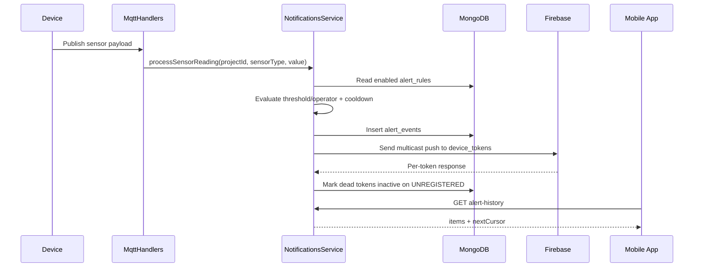

# NexusFlow Notifications System Guide

## Purpose

This document explains how notifications work end-to-end in NexusFlow so mobile developers and backend contributors can integrate safely.

Current implementation scope:
- Push delivery through Firebase Cloud Messaging (FCM)
- Alert history persistence for offline recovery
- Policy, preference, and rule management APIs
- Runtime rule evaluation from MQTT sensor input

Important current mapping:
- `projectId` in notification APIs is currently the same value as `flowId`.

## High-Level Flow



## Main Components

- `src/notifications/notifications.service.ts`
  - core business logic
  - FCM initialization and sending
  - dead token cleanup
  - policies/preferences/rules handling
  - alert history pagination
- `src/notifications/notifications.controller.ts`
  - mobile device token registration endpoint
- `src/notifications/project-alert-config.controller.ts`
  - policies, rules, and notification preferences endpoints
- `src/notifications/project-alert-history.controller.ts`
  - alert history endpoint
- `src/notifications/notifications-internal.controller.ts`
  - internal alert trigger endpoint
- `src/mqtt/mqtt.handlers.ts`
  - evaluates rules for incoming sensor messages and triggers alerts

## MongoDB Collections

- `device_tokens`
  - registered mobile push tokens
  - stores `isActive`, `lastError`, `invalidatedAt`, `lastSeenAt`
- `alert_events`
  - durable alert history (source of truth for missed alerts)
- `alert_policies`
  - default behavior per sensor type (`required`, `thresholdRequired`, severity)
- `notification_preferences`
  - per-user overrides for enabled state and threshold
- `alert_rules`
  - runtime rules evaluated on sensor readings

## API Contract

All user-facing endpoints below require cookie auth:
- Header: `Cookie: jwt=<token>`

### 1) Register device token

- `POST /v1/notifications/devices/register`
- Body:

```json
{
  "projectId": "6802ec3f7fd4db8af143dcf1",
  "deviceId": "mobile-device-001",
  "platform": "android",
  "fcmToken": "fcm-token",
  "appVersion": "1.0.0",
  "locale": "en-US"
}
```

Behavior:
- upsert by `(userId, deviceId)`
- reactivates previously invalidated token
- updates `lastSeenAt`

### 2) Notification preferences

- `GET /v1/projects/:projectId/notification-preferences`
- `PUT /v1/projects/:projectId/notification-preferences`

Update body:

```json
{
  "sensors": [
    { "sensorType": "MQ", "enabled": true, "threshold": 300 },
    { "sensorType": "HUMIDITY", "enabled": true, "threshold": 72 }
  ]
}
```

Rules:
- `required=true` policies are always forced to `enabled=true`
- unknown `sensorType` causes `400`
- if `thresholdRequired=true` and no threshold is available, request fails with `400`

### 3) Alert policies

- `GET /v1/projects/:projectId/alert-policies`
- `PUT /v1/projects/:projectId/alert-policies`

Upsert body:

```json
{
  "policies": [
    {
      "sensorType": "MQ",
      "required": true,
      "thresholdRequired": true,
      "defaultEnabled": true,
      "defaultSeverity": "critical"
    }
  ]
}
```

### 4) Alert rules

- `GET /v1/projects/:projectId/alert-rules`
- `POST /v1/projects/:projectId/alert-rules`
- `PATCH /v1/projects/:projectId/alert-rules/:ruleId`
- `DELETE /v1/projects/:projectId/alert-rules/:ruleId`

Create body:

```json
{
  "sensorType": "MQ",
  "operator": ">",
  "threshold": 300,
  "severity": "critical",
  "enabled": true,
  "actions": [
    {
      "type": "send_push",
      "payload": {
        "title": "Gas Leak Alert",
        "body": "MQ level exceeded threshold"
      }
    }
  ]
}
```

### 5) Alert history (missed notifications support)

- `GET /v1/projects/:projectId/alert-history?limit=50&cursor=...`
- default `limit=50`, max `100`
- response contains:
  - `items`
  - `nextCursor` (or `null`)

### 6) Internal alert trigger

- `POST /v1/internal/alerts/trigger`
- Optional header:
  - `x-internal-key: <INTERNAL_ALERTS_API_KEY>`
- Body:

```json
{
  "projectId": "6802ec3f7fd4db8af143dcf1",
  "sensorType": "MQ",
  "severity": "critical",
  "value": 430,
  "threshold": 300
}
```

Behavior:
- persists `alert_events` first
- then attempts push dispatch

## Dead Token Handling

When FCM marks a token invalid (for example app uninstalled):
- service catches error codes like:
  - `messaging/registration-token-not-registered`
  - `UNREGISTERED`
- token is marked inactive:
  - `isActive = false`
  - `lastError = "UNREGISTERED"`
  - `invalidatedAt = now`

This prevents repeated wasteful sends.

## Runtime Rule Evaluation

At MQTT ingestion time:
- sensor type and value are extracted from payload
- all enabled rules for project are evaluated
- operator comparison applied (`>`, `<`, `>=`, `<=`, `==`, `!=`)
- cooldown is applied per rule using `ALERT_RULE_COOLDOWN_MS` (default `60000`)
- on match:
  - event saved to history
  - push dispatched

## Ownership and Access

Before reading/updating notification data:
- service verifies current user owns the flow identified by `projectId`
- if flow ownership check fails, request is rejected with `403`

## Required Environment Variables

- `FIREBASE_PROJECT_ID`
- `FIREBASE_CLIENT_EMAIL`
- `FIREBASE_PRIVATE_KEY`
- `INTERNAL_ALERTS_API_KEY` (recommended in non-local environments)
- `ALERT_RULE_COOLDOWN_MS` (optional)

## Mobile Integration Notes

- Always call `register` after login and whenever token refreshes.
- Use `alert-history` on app open/resume to recover missed alerts.
- Store `nextCursor` for infinite scroll.
- Do not rely on push as the only source of truth; history is authoritative.
- Keep `projectId` consistent with active flow id in current backend.

## Postman

Ready-to-use requests are available in:
- `docs/NexusFlow.postman_collection.json`
- Folder: `Notifications`
