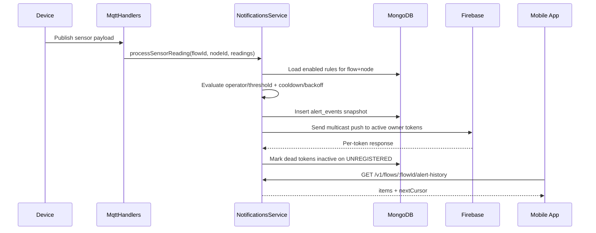

# NexusFlow Notifications System Guide

## Purpose

This guide explains the current notifications architecture and API contract used by backend and mobile.

Scope:

- FCM device-token registration
- Global alert policies
- Per-flow notification preferences
- Per-flow/node alert rules
- Alert history for missed notifications
- Alert notification handshake state (received/handled)
- Internal alert trigger endpoint

## Core Model

- `flowId`: flow scope for rules/preferences/history
- `nodeId`: specific node instance inside a flow
- `moduleId`: module type (example: `MQ2-Sensor`, `DHT-Sensor-22`)
- `readingKey`: reading field for that module (example: `analog`, `temperature`)

Rule identity and linking:

- A rule is linked by `flowId + nodeId + moduleId + readingKey`
- Backend validates that `nodeId` actually belongs to the flow and matches `moduleId`
- Unique guard exists per `flowId + nodeId + readingKey` to avoid duplicates

## Runtime Pipeline



## Mongo Collections

- `device_tokens`
- `alert_policies`
- `notification_preferences`
- `alert_rules`
- `alert_events`

## API Contract

All user-facing endpoints require `Cookie: jwt=<token>`.

### 1) Register Device Token

- `POST /v1/notifications/devices/register`

```json
{
  "deviceId": "mobile-device-001",
  "platform": "android",
  "fcmToken": "replace-with-real-fcm-token",
  "appVersion": "1.0.0",
  "locale": "en-US"
}
```

Notes:

- Device-scoped only (no `flowId` in body)
- Upsert by `(userId, deviceId)`
- If token exists for another user/device, old mapping is removed

### 2) Alert Policies (Global)

- `GET /v1/alert-policies?moduleId=MQ2-Sensor`
- `PUT /v1/alert-policies` (admin only)

`PUT` body:

```json
{
  "policies": [
    {
      "moduleId": "MQ2-Sensor",
      "readingKey": "analog",
      "label": "MQ2 Gas Level (Analog)",
      "required": true,
      "thresholdRequired": true,
      "defaultEnabled": true,
      "defaultSeverity": "critical",
      "defaultOperator": ">",
      "defaultThreshold": 300,
      "defaultMin": null,
      "defaultMax": null,
      "supportedOperators": [">", "<", ">=", "<=", "=", "between", "outside"],
      "isActive": true
    }
  ]
}
```

Policy validation:

- `defaultOperator` must be one of `supportedOperators`
- Simple operators (`>`, `<`, `>=`, `<=`, `=`) require `defaultThreshold` and require `defaultMin/defaultMax = null`
- Range operators (`between`, `outside`) require `defaultMin/defaultMax` and require `defaultThreshold = null`

### 3) Notification Preferences (Per Flow)

- `GET /v1/flows/:flowId/notification-preferences`
- `PUT /v1/flows/:flowId/notification-preferences`

`PUT` body:

```json
{
  "notificationsEnabled": true,
  "channels": ["push"]
}
```

Notes:

- `notificationsEnabled: true` requires at least one active alert rule for the flow. If no rules exist, the API returns `400 Bad Request` with message: "Cannot enable notifications for a flow with no alert rules. Please create an alert rule first."
- `notificationsEnabled: false` is always allowed
- `channels` is optional on update; if omitted, the backend defaults to `['push']`
- `GET` returns `404` if preference doc does not exist yet

Legacy compatibility note:

- The backend supports both `flowId` and legacy `projectId` in existing `notification_preferences` documents.
- This avoids duplicate-key failures in environments that still have an old unique index on `projectId + userId`.
- New writes keep preferences aligned with flow-scoped routing (`/v1/flows/:flowId/...`).

**Important: Alert Rules Requirement**

- Notifications can only be enabled if the flow has at least one alert rule
- Before enabling notifications, ensure the flow has created alert rules (see section 4 below)
- Attempting to enable notifications without alert rules will fail with a clear error message

Note about flow listing:

- The client-facing `GET /v1/flows` (flows list) now includes an `isNotificationsEnabled` boolean on each flow object
- This value is `false` when:
  - The flow has no alert rules, OR
  - The notification preference is explicitly disabled
- `isNotificationsEnabled: true` only when the flow has alert rules AND the user has enabled notifications
- Frontend clients should:
  1. Check `isNotificationsEnabled` to determine if notifications are active
  2. Show a message to the user if they try to enable notifications without alert rules
  3. After creating alert rules, call `PUT /v1/flows/:flowId/notification-preferences` to enable notifications

### 4) Alert Rules (Per Flow + Node)

- `GET /v1/flows/:flowId/alert-rules?nodeId=<optional>`
- `GET /v1/flows/:flowId/alert-rules/:ruleId`
- `POST /v1/flows/:flowId/alert-rules`
- `PATCH /v1/flows/:flowId/alert-rules/:ruleId`
- `DELETE /v1/flows/:flowId/alert-rules/:ruleId`

Create example:

```json
{
  "nodeId": "MQ2-Sensor-1777061998955-55w",
  "moduleId": "MQ2-Sensor",
  "readingKey": "analog",
  "operator": ">",
  "threshold": 300,
  "severity": "critical",
  "enabled": true,
  "actions": [
    {
      "type": "send_push",
      "payload": {
        "title": "Gas Leak Alert",
        "body": "MQ2 analog level exceeded threshold"
      }
    }
  ]
}
```

Validation highlights:

- Node must exist inside flow
- Reading key must be allowed for module
- Operator must match provided condition fields (`threshold` or `min/max`)
- Required-policy rules cannot be disabled/deleted

Operator notes:

- `=` is supported and is used for binary sensors (`digital = 1`, `motion = 1`)

### 5) Alert History

- `GET /v1/flows/:flowId/alert-history?limit=50&since=<hours>&cursor=<optional>&nodeId=<optional>&severity=<optional>`

Behavior:

- Sorted by `occurredAt desc`, then `_id desc`
- Cursor pagination returns `nextCursor` and `hasMore`
- `since` is in hours; default is `24` when omitted
- `since` accepts positive integer strings and is capped at `720`
- This is the source for missed notifications when device was offline
- Each history item now includes handshake flags:
  - `notificationReceived` (device received push)
  - `notificationHandled` (user opened/interacted)

### 5.1) Alert Notification Handshake (Mobile Ack)

- `POST /v1/notifications/alert-history/:historyId/received`
- `POST /v1/notifications/alert-history/:historyId/handled`

Contract:

- Mobile app sends `received` when push reaches the device.
- Mobile app sends `handled` when user opens/interacts with the alert.
- `handled` also implies `received` if not already set.

Server behavior:

- If latest alert state is `handled`, backend suppresses future sends for that alert lineage (same flow/rule/node/reading key).
- If latest alert state is `received` but not `handled`, backend throttles reminder pushes using `ALERT_RECEIVED_REMINDER_MS`.
- If no receive ack exists, backend keeps normal trigger behavior.

Response shape for both endpoints:

```json
{
  "historyId": "6802ec3f7fd4db8af143dcf1",
  "flowId": "69b58d513b6489cbd6655026",
  "ruleId": "69e7cf54e463e7c6e48fb54d",
  "nodeId": "MQ2-Sensor-1777061998955-55w",
  "notificationReceived": true,
  "notificationHandled": false,
  "notificationReceivedAt": "2026-05-02T10:00:00.000Z",
  "notificationHandledAt": null
}
```

### 5.2) MQ2 Repeated-Alert Throttling

- MQ2 (`moduleId = MQ2-Sensor`) uses exponential backoff when a rule stays matched.
- First match fires immediately, then subsequent alerts wait progressively longer.
- Backoff starts from `ALERT_RULE_COOLDOWN_MS` and doubles up to `ALERT_RULE_MAX_BACKOFF_MS`.
- When reading returns to normal (rule no longer matched), backoff state is reset.

### 6) Internal Trigger Endpoint

- `POST /v1/internal/alerts/trigger`
- Optional header: `x-internal-key: <INTERNAL_ALERTS_API_KEY>`

Body:

```json
{
  "flowId": "69b58d513b6489cbd6655026",
  "ruleId": "69e7cf54e463e7c6e48fb54d",
  "nodeId": "MQ2-Sensor-1777061998955-55w",
  "moduleId": "MQ2-Sensor",
  "readingKey": "analog",
  "operator": ">",
  "value": 430,
  "threshold": 300
}
```

## Dead Token Handling

When Firebase returns dead-token errors (`UNREGISTERED`, `messaging/registration-token-not-registered`, `messaging/invalid-registration-token`):

- token is marked inactive
- `lastError` and `invalidatedAt` are updated
- future sends skip inactive tokens

## Offline / Missed Alerts

Push is not durable delivery. Mobile should always call:

- `GET /v1/flows/:flowId/alert-history`

on app open/resume to backfill alerts that may have been missed while offline.

## Auto-Created Rules

- On flow save/update, backend syncs rules by node list.
- For each node, backend loads all active policies where `policy.moduleId == node.moduleId`.
- One rule is auto-created per matching `readingKey` policy.
- If a node is removed from the flow, all its rules are deleted (cascade by `nodeId`).

## Logout FCM Cleanup

- `POST /auth/logout` accepts optional body:

```json
{
  "deviceId": "mobile-device-001"
}
```

- If `deviceId` is provided, backend removes the matching token only for the authenticated user.
- Response includes `fcmTokenCleared`:
  - `true` when token record was deleted
  - `false` when no matching token was found or `deviceId` was not provided

## Required Environment Variables

- `FIREBASE_PROJECT_ID`
- `FIREBASE_CLIENT_EMAIL`
- `FIREBASE_PRIVATE_KEY`
- `INTERNAL_ALERTS_API_KEY` (recommended outside local)
- `ALERT_RULE_COOLDOWN_MS` (optional, default `60000`)
- `ALERT_RULE_MAX_BACKOFF_MS` (optional, default `900000`)
- `ALERT_RECEIVED_REMINDER_MS` (optional, default `600000`)
