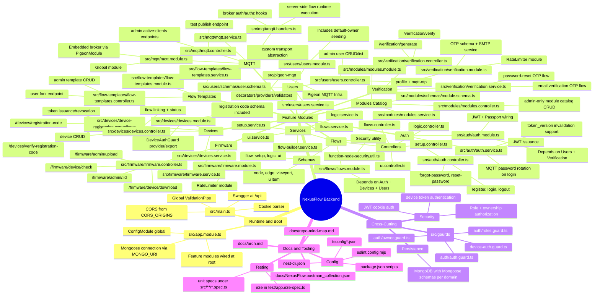

# NexusFlow Backend - Repository Mind Map

## Suggested Reading Order

1. `src/main.ts` -> runtime bootstrap and global middleware
2. `src/app.module.ts` -> dependency and module composition
3. `src/auth` + `src/users` + `src/verification` -> identity and access model
4. `src/devices` + `src/mqtt` + `src/pigeon-mqtt` -> device connectivity and broker behavior
5. `src/flows` + `src/flow-templates` + `src/modules` -> domain logic and flow orchestration
6. `src/firmware` -> OTA firmware lifecycle
