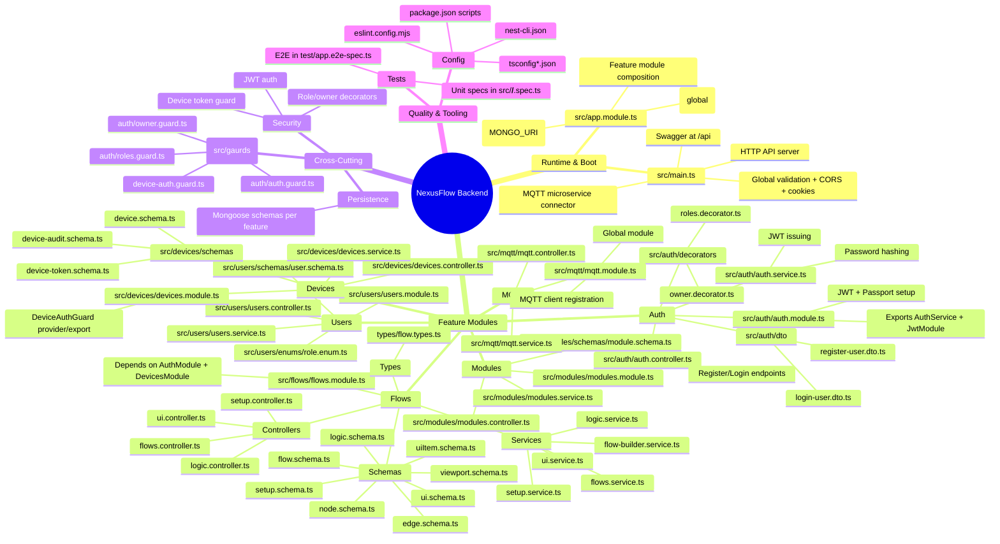

# NexusFlow Backend — Repository Mind Map

## Suggested reading order

1. `src/main.ts` → understand runtime setup.
2. `src/app.module.ts` → understand dependency wiring.
3. `src/auth` + `src/users` → baseline identity model.
4. `src/devices` + `src/mqtt` → device connectivity.
5. `src/flows` → domain-specific orchestration logic.
